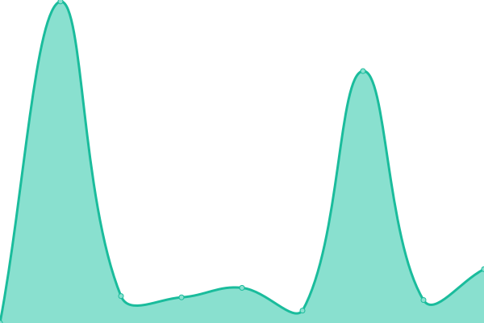

# [📈 Live Status](https://uptime.rainysystems.ch): <!--live status--> **🟧 Partial outage**

This repository contains the open-source uptime monitor and status page for [RainySystems](https://RainySystems.ch "Coming soon"), powered by [Upptime](https://github.com/upptime/upptime).

With [Upptime](https://upptime.js.org), you can get your own unlimited and free uptime monitor and status page, powered entirely by a GitHub repository. We use [Issues](https://github.com/RainySystems/RainyUptime/issues) as incident reports, [Actions](https://github.com/RainySystems/RainyUptime/actions) as uptime monitors, and [Pages](https://uptime.rainysystems.ch) for the status page.

<!--start: status pages-->
<!-- This summary is generated by Upptime (https://github.com/upptime/upptime) -->
<!-- Do not edit this manually, your changes will be overwritten -->
<!-- prettier-ignore -->
| URL | Status | History | Response Time | Uptime |
| --- | ------ | ------- | ------------- | ------ |
|  [RainySystems HomePage](https://RainySystems.ch) | 🟥 Down | [rainy-systems-home-page.yml](https://github.com/RainySystems/RainyUptime/commits/HEAD/history/rainy-systems-home-page.yml) | 

 422ms
     
 | 

<a href="https://uptime.rainysystems.ch/history/rainy-systems-home-page">0.00%</a>
    

|  [RainySystems API](https://api.rainysystems.ch) | 🟥 Down | [rainy-systems-api.yml](https://github.com/RainySystems/RainyUptime/commits/HEAD/history/rainy-systems-api.yml) | 

 0ms
     
 | 

<a href="https://uptime.rainysystems.ch/history/rainy-systems-api">0.00%</a>
    

|  [RainyDo](https://RainyDo.ch) | 🟩 Up | [rainy-do.yml](https://github.com/RainySystems/RainyUptime/commits/HEAD/history/rainy-do.yml) | 

 166ms
     
 | 

<a href="https://uptime.rainysystems.ch/history/rainy-do">100.00%</a>
    

|  [RainyDo API](https://api.rainysystems.ch) | 🟥 Down | [rainy-do-api.yml](https://github.com/RainySystems/RainyUptime/commits/HEAD/history/rainy-do-api.yml) | 

 0ms
     
 | 

<a href="https://uptime.rainysystems.ch/history/rainy-do-api">0.00%</a>
    

|  [Stormki Homepage](https://stormki.net) | 🟩 Up | [stormki-homepage.yml](https://github.com/RainySystems/RainyUptime/commits/HEAD/history/stormki-homepage.yml) | 

 640ms
     
 | 

<a href="https://uptime.rainysystems.ch/history/stormki-homepage">100.00%</a>
    

|  [RainySMM](https://RainySMM.net) | 🟥 Down | [rainy-smm.yml](https://github.com/RainySystems/RainyUptime/commits/HEAD/history/rainy-smm.yml) | 

 0ms
     
 | 

<a href="https://uptime.rainysystems.ch/history/rainy-smm">0.00%</a>
    

<!--end: status pages-->

[**Visit our status website →**](https://uptime.rainysystems.ch)

## 📄 License

- Powered by: [Upptime](https://github.com/upptime/upptime)
- Code: [MIT](./LICENSE) © [RainySystems](https://RainySystems.ch "Coming soon")
- Data in the `./history` directory: [Open Database License](https://opendatacommons.org/licenses/odbl/1-0/)
